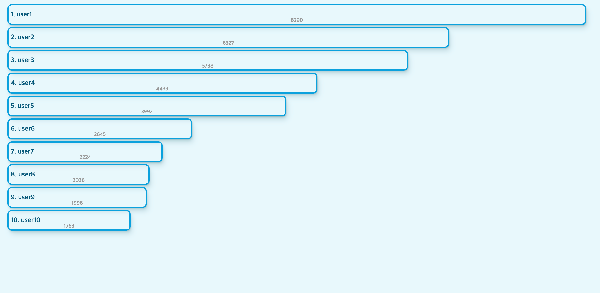
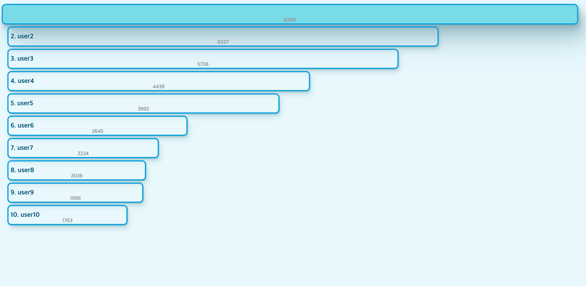

# log-text-visualizer
visualize log texts in log files




## Introduction

- parse `*.log` files using scala & spark
- visualize datas with d3

[Codepen Demo](https://codepen.io/sundicide/pen/VwQvrLe?editors=0010)

## Spark

parse texts, filters and make count using `groupby`, `mapValues`

```scala
val filteredLines: RDD[Row] = logLines.map(line => parseLog(line))
  .filter(loggerData => loggerData != null)
  .filter(loggerData => isValidLog(loggerData))
  .map((loggerData) => (loggerData.getUser(), loggerData))
  .groupBy(d => d._1)
  .mapValues(d => d.foldLeft(0)((acc, _) => acc + 1))
  .sortBy(logPair => logPair._2)
  .map(logPair => Row(logPair._1, logPair._2))
```

> log text example
> 2022-01-01 01:01:12 [info]: [user1]: GET /userdata

